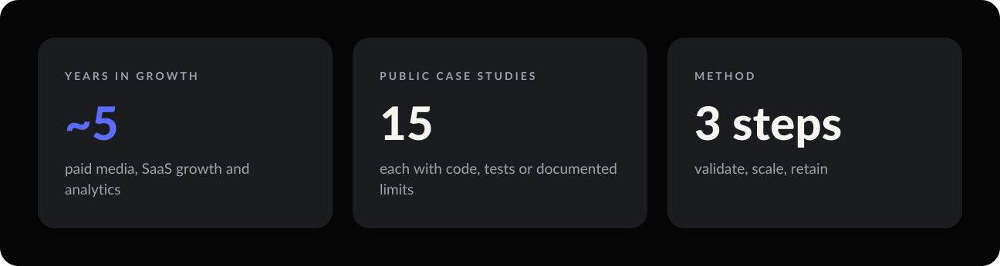
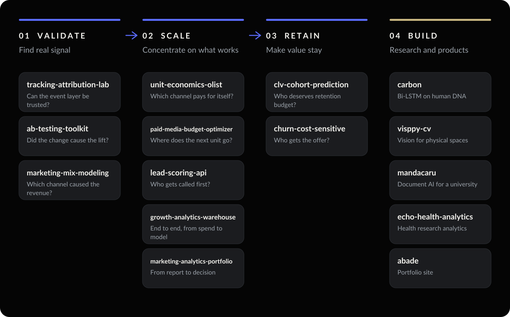

  
  
  

**I build the layers between marketing activity and the money it produces:** measurement that can be
trusted, analysis that survives being questioned, and models that end in a decision someone can act on.

Around five years across paid media, SaaS growth and analytics, mostly in businesses where the marketing
number and the finance number had to agree. What I am useful for is the join: connecting campaign
behaviour to CAC, LTV, payback and contribution margin, then building the thing that computes it instead
of stopping at the recommendation.

---

## The portfolio, as one system

Every repository answers one question in a growth system: **validate** that the signal is real,
**scale** what works, **retain** the value it creates. A fourth track holds applied research and
products.

Every case follows the same arc: **Context → Problem → Strategy → Result**, followed by its limits and
the next move.

---

## Featured cases

### 01 · Validate

| | Problem | Result |
| --- | --- | --- |
| [**marketing-mix-modeling**](https://github.com/arielabade/marketing-mix-modeling) | How much revenue did each channel cause? On real data, an MMM cannot be scored. | Fitted against a known process: **perfect ranking** on every channel with signal. A pre-fit signal-to-noise check flags the one it cannot measure (+636% ROI error). |
| [**ab-testing-toolkit**](https://github.com/arielabade/ab-testing-toolkit) | Can this experiment answer its question, and what do we do with the answer? | Separates *no effect* from *no power*. CUPED cuts variance **75%**, worth 4x the traffic. Calibrated on 2,000 simulated A/A tests. |
| [tracking-attribution-lab](https://github.com/arielabade/tracking-attribution-lab) | Can this CPA be trusted? | Five named event states and SQL checks that catch loss before reporting. |

### 02 · Scale

| | Problem | Result |
| --- | --- | --- |
| [**unit-economics-olist**](https://github.com/arielabade/unit-economics-olist) | Which acquisition channels pay for themselves in a marketplace? | **97%** of customers buy once, so CAC must clear on the first order. Paid channels consume **71%** of a R$ 16.13 margin ceiling. |
| [**lead-scoring-api**](https://github.com/arielabade/lead-scoring-api) | Who should a call centre call first, before anyone dials? | The usual 0.954 AUC becomes **0.640** once two leaks are removed. What survives: a **1.54x** lift, and 30% of capacity reaching 46% of conversions. FastAPI + Docker. |
| [growth-analytics-warehouse](https://github.com/arielabade/growth-analytics-warehouse) | Where does paid media pay back, and can the data be trusted? | End-to-end synthetic platform: snowflake warehouse, 68 quality checks, SQL catalog, model and app. Only the US clears 3x LTV/CAC. |
| [paid-media-budget-optimizer](https://github.com/arielabade/paid-media-budget-optimizer) | Where does the next unit of budget go? | A transparent score where headroom, not efficiency alone, decides growth. |
| [marketing-analytics-portfolio](https://github.com/arielabade/marketing-analytics-portfolio) | How does a report become a decision? | One KPI layer and one case format that ends in a decision and a limitation. |

### 03 · Retain

| | Problem | Result |
| --- | --- | --- |
| [**clv-cohort-prediction**](https://github.com/arielabade/clv-cohort-prediction) | Who deserves retention budget, predicted before the spend? | BG/NBD + Gamma-Gamma beats LightGBM on every metric (MAE £484 vs £645). The top decile captures **51.2%** of holdout value. |
| [**churn-cost-sensitive**](https://github.com/arielabade/churn-cost-sensitive) | Who gets a retention offer that costs money and works only sometimes? | Break-even churn probability ranges from 2.7% to 19.6%. Thresholds from retention economics recover **£10,285**, 21% of achievable value. |

### 04 · Build: research and products

| | Result |
| --- | --- |
| [carbon](https://github.com/arielabade/carbon) | Exon/intron classification in human DNA with a Bi-LSTM, **99.80%** test accuracy against three controlled baselines. Paper accepted at an international bioinformatics conference. |
| [visppy-cv](https://github.com/arielabade/visppy-cv) | Computer vision for physical spaces. Among the 47 approved in the Centelha Sergipe III preliminary Phase 2 result. |
| [mandacaru](https://github.com/arielabade/mandacaru) | Intelligent document processing built in the STI/UFS context, with benchmarked model alternatives. |
| [echo-womens-health-research-analytics](https://github.com/arielabade/echo-womens-health-research-analytics) | Survey-based evaluation of a remote women's health training programme. |

---

## How I work

**Every project states what it cannot show.** The limits sections carry the assumptions that would
change the conclusion, the data that is simulated and why, and the question the analysis could not
answer. A result without its boundary is not a result.

**Assumptions live in one file.** Where a number is assumed rather than measured, it is named and
isolated, so a reviewer can change it and re-run.

**The decision comes first.** Each README opens with the result and the decision it supports, then
shows the evidence.

## Stack

| | |
| --- | --- |
| **Analytics** | SQL · Python · pandas · DuckDB · dbt |
| **ML and statistics** | scikit-learn · LightGBM · PyMC-Marketing · MLflow · SciPy · statsmodels |
| **Engineering** | FastAPI · Docker · GitHub Actions · Plotly Dash · Streamlit |
| **Marketing** | GA4 · Meta Ads · Google Ads |

---

## Em português

Trabalho na junção entre marketing e receita: mensuração confiável, análise que sobrevive a
questionamento e modelos que terminam numa decisão (CAC, LTV, payback, margem de contribuição,
retenção e incrementalidade).

São cerca de cinco anos entre mídia paga, growth em SaaS e analytics. O diferencial é construir a
ferramenta em vez de parar no relatório. Os projetos acima têm código rodando, testes e premissas
documentadas, organizados em um único método: **validar** o sinal, **escalar** o que funciona e
**reter** o valor criado.

Cada projeto declara o que **não** consegue mostrar. É de propósito: premissa escondida é a forma mais
cara de errar uma decisão de investimento.

---

  ABADE · Strategy · Data · Growth

