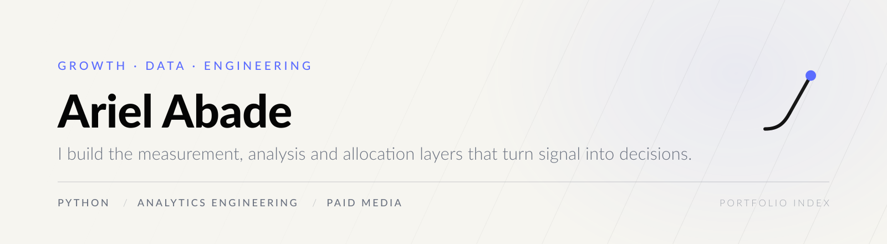
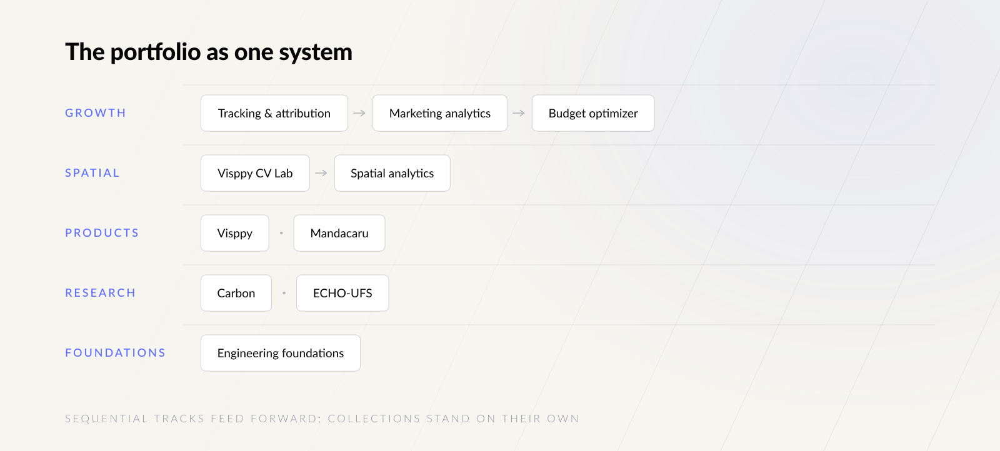

  <picture>
    <source media="(prefers-color-scheme: dark)" srcset="assets/brand/header-dark.svg">
    
  </picture>

  
  
  

**Data becomes a decision or it becomes decoration.** I work at the intersection of machine learning,
analytics, software and business performance — building the layers that turn measured behaviour into
an action someone can actually take.

---

## The portfolio as one system

  <picture>
    <source media="(prefers-color-scheme: dark)" srcset="assets/brand/map-dark.svg">
    
  </picture>

These repositories are not a list of exercises. Two of them are **sequential tracks**, where each
layer only makes sense because the previous one is trustworthy.

### Growth track — from event to budget

| | Repository | What it decides |
| --- | --- | --- |
| **01** | [tracking-attribution-lab](https://github.com/arielabade/tracking-attribution-lab) | Can this number be trusted? Event lifecycle, UTM governance, quality checks in SQL. |
| **02** | [marketing-analytics-portfolio](https://github.com/arielabade/marketing-analytics-portfolio) | What changed, what matters, what follows? KPI definitions and a case format that ends in a limitation. |
| **03** | [paid-media-budget-optimizer](https://github.com/arielabade/paid-media-budget-optimizer) | Where does the next unit of budget go? Transparent scoring over spend, return, volume and headroom. |
| **04** | [growth-analytics-warehouse](https://github.com/arielabade/growth-analytics-warehouse) | **Featured.** Where does paid media pay back, what would a free limit do, who upgrades next? Synthetic freemium SaaS: seeded generator, tested pipeline, DuckDB snowflake warehouse, SQL catalog, analysis and Dash app with monitoring. |

### Spatial track — from movement to operation

| | Repository | What it decides |
| --- | --- | --- |
| **01** | [visppy-cv-lab](https://github.com/arielabade/visppy-cv-lab) | When does movement become a countable event? |
| **02** | [spatial-analytics-dashboard](https://github.com/arielabade/spatial-analytics-dashboard) | Which zone should operations act on? |

### Products

| Repository | Context |
| --- | --- |
| [visppy-cv](https://github.com/arielabade/visppy-cv) | Spatial intelligence for physical spaces. Selected in the Centelha Sergipe III preliminary Phase 2 result. [visppy.com](https://visppy.com) |
| [mandacaru](https://github.com/arielabade/mandacaru) | Intelligent document processing for higher education, developed in the STI/UFS context. |

### Research

| Repository | Context |
| --- | --- |
| [carbon](https://github.com/arielabade/carbon) | Exon and intron classification in human DNA with a bidirectional LSTM. Developed for a paper accepted at a bioinformatics conference in Portugal. |
| [echo-womens-health-research-analytics](https://github.com/arielabade/echo-womens-health-research-analytics) | Survey-based evaluation of a remote women's health training initiative. Aggregate outputs only. |

### Foundations

| Repository | Context |
| --- | --- |
| [miscellaneous](https://github.com/arielabade/miscellaneous) | Curated implementations across paradigms, software engineering, data and infrastructure. |

---

## How I work

| | |
| --- | --- |
| **Measure before claiming** | Separate fact, insight and hypothesis. A metric with no stated definition is not a metric. |
| **Validate, then scale** | Scaling before validating only multiplies what is not yet adjusted. |
| **State the limitation** | Every case in this portfolio ends with what it cannot show. An analysis that hides its boundaries is not an analysis. |
| **Build for the next decision** | Every deliverable should point at the next move, not only at the last result. |

---

## What I build

- **Measurement and attribution layers** — tracking design, event governance, data quality
- **Analytics systems**, dashboards and decision-support structures
- **Machine learning models** for classification, prediction and sequence analysis
- **AI-powered products** and intelligent workflows
- **Automation pipelines** with Python, APIs and workflow orchestration
- **Growth and performance frameworks** for SaaS and digital products

**Core areas:** Machine Learning · Applied AI · Growth Analytics · SaaS Performance · Data
Automation · NLP & LLM Systems · Experimentation & Optimization

---

## Stack

  
  
  
  
  
  
  
   
  
  
  
  
  

---

## The visual system

Every repository here runs on one system, so the portfolio reads as a body of work rather than a
collection of accidents.

| Token | Hex | Role |
| --- | --- | --- |
| Carbon | `#050505` | Foundation, backgrounds, authority |
| Ivory | `#F6F5F0` | Breathing room, editorial surfaces |
| Graphite | `#1B1C1F` | Text and secondary surfaces |
| Steel | `#7E8791` | Metadata, support, interface |
| Cobalt | `#5B6CFF` | Action, direction — the single accent |
| Aurum | `#C8B680` | Reserved for special emphasis |

Roughly 70% neutrals, 20% support, 10% accent. Charts start in neutrals and use Cobalt only on the
series that answers the question. Headers ship in both themes and carry outlined type, so they render
identically everywhere. Repositories with their own brand — Visppy, Mandacaru — keep it: the
portfolio integrates with them in monochrome rather than competing.

Typography is a single family, **Lato**, across headlines, body and figures.

---

  <a href="https://www.linkedin.com/in/ariel-abade-669869171/">LinkedIn</a>
  &nbsp;·&nbsp;
  <a href="https://github.com/arielabade">GitHub</a>

