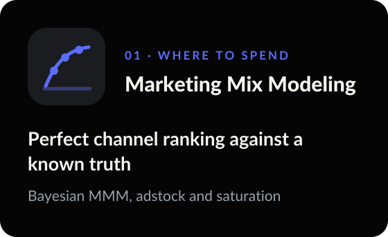
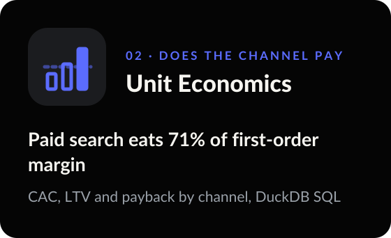
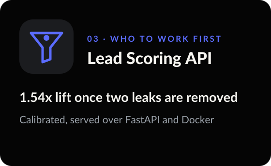
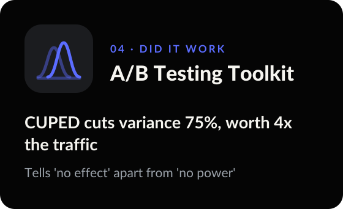
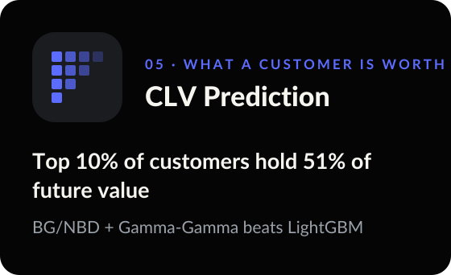
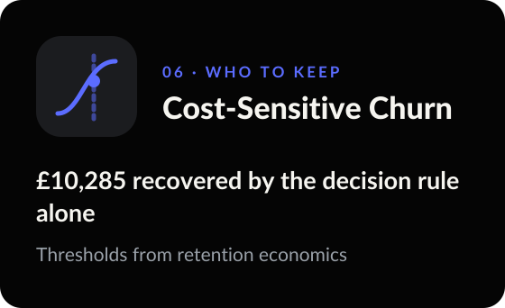
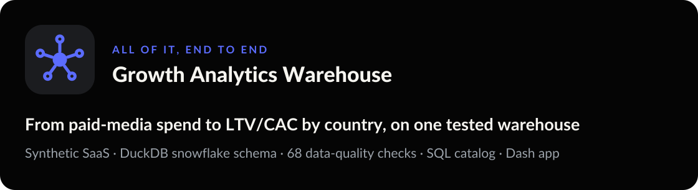

  
  
  

I've spent more than five years acquiring customers through paid media, mostly for SaaS, e-commerce and
services. In most companies that work is split in two: one person runs the campaigns, and someone else
builds the models that say where the money should go. **I do both.** I run the campaigns, and I build the
models that decide where the next unit of budget goes.

At **Blocks**, a product-led SaaS with a marketplace and programmatic SEO, I led growth for about five
years. I managed paid media against gross margin, not against CPA or ROAS in isolation, and used logistic
regression to find out which channels actually produced recurring revenue. Before that I was a paid-media
analyst at the Atacama and BG9 agencies, and spent about three years with Axiom, a technical training company.

Today I run **ABADE**, my marketing analytics and paid-media consultancy. I build my own
campaign-optimisation and data tools on LLM APIs in Google Cloud. My background is a B.Sc. in Information
Systems from UFS, where I also did machine-learning research.

> **Looking for** Marketing Data Scientist, Growth/CRM or Acquisition roles where data and media spend
> answer directly to revenue.

---

## Follow one marketing dollar

Each project below answers one question that a marketing dollar runs into, from the moment it is spent to
the moment the customer it bought either stays or leaves. Click a card to open the case.

  
  
  

  
  
  

  

Every case opens with the decision it supports and ends with what it **cannot** show. A hidden
assumption is the most expensive way to get an investment decision wrong.

<b>More on measurement and paid media</b>

 

- [tracking-attribution-lab](https://github.com/arielabade/tracking-attribution-lab): five named event states and SQL checks that catch tracking loss before it reaches a CPA.
- [paid-media-budget-optimizer](https://github.com/arielabade/paid-media-budget-optimizer): a transparent campaign score where headroom, not efficiency alone, decides where budget grows.
- [marketing-analytics-portfolio](https://github.com/arielabade/marketing-analytics-portfolio): one KPI layer and one case format that turns a campaign report into a decision.
- [dados-sinteticos-ecommerce-tecidos](https://github.com/arielabade/dados-sinteticos-ecommerce-tecidos) and [dados-sinteticos-streaming-cinelume](https://github.com/arielabade/dados-sinteticos-streaming-cinelume): synthetic Brazilian businesses (Meta and Google Ads, GA4, CAPI, attribution, MySQL and dbt) for practising acquisition analytics on production-shaped data. In Portuguese.

<b>Research and products, outside marketing</b>

 

- [carbon](https://github.com/arielabade/carbon): exon/intron classification in human DNA with a Bi-LSTM (99.80% test accuracy). The paper was accepted at an international bioinformatics conference.
- [visppy-cv](https://github.com/arielabade/visppy-cv): computer vision for physical spaces. It was among the 47 projects approved in the preliminary Phase 2 result of Centelha Sergipe III.
- [mandacaru](https://github.com/arielabade/mandacaru): intelligent document processing built at STI/UFS.
- [echo-womens-health-research-analytics](https://github.com/arielabade/echo-womens-health-research-analytics): survey-based evaluation of a remote women's health training programme.

## What I work with

**Acquisition:** Google Ads · Meta Ads · GA4 · conversion funnels · attribution and channel evaluation 
**Revenue modelling:** unit economics (CAC, LTV, payback, margin) · MMM · CLV · churn · experimentation 
**Stack:** SQL · Python · DuckDB · dbt · scikit-learn · LightGBM · PyMC-Marketing · FastAPI · Docker 
**Automation:** LLMs via API on Google Cloud for campaign and data tooling

---

## Em português

Sou cientista de dados com mais de 5 anos em aquisição de clientes via mídia paga, principalmente em SaaS,
e-commerce e serviços. Meu diferencial é juntar duas áreas que costumam ficar separadas: **eu opero as
campanhas e também construo os modelos que dizem onde investir.**

Na Blocks, um SaaS PLG com marketplace e SEO programático, liderei growth por cerca de 5 anos, gerindo
mídia paga com foco em margem bruta e usando regressão logística para avaliar quais canais de fato geravam
receita recorrente. Hoje toco a **ABADE**, minha consultoria de marketing analytics e mídia paga.

Busco posições de **Marketing Data Scientist, Growth/CRM ou Aquisição** em que dados e investimento em mídia
estejam diretamente ligados a receita.

---

  ABADE · Strategy · Data · Growth

